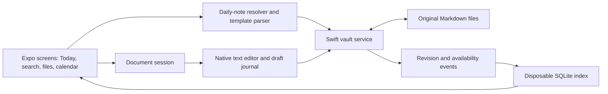
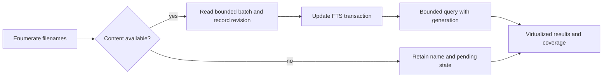
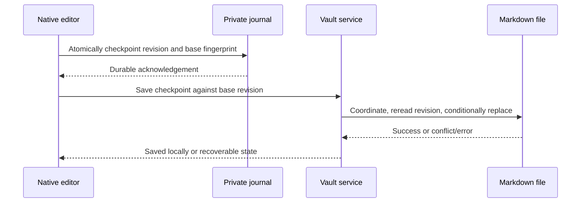
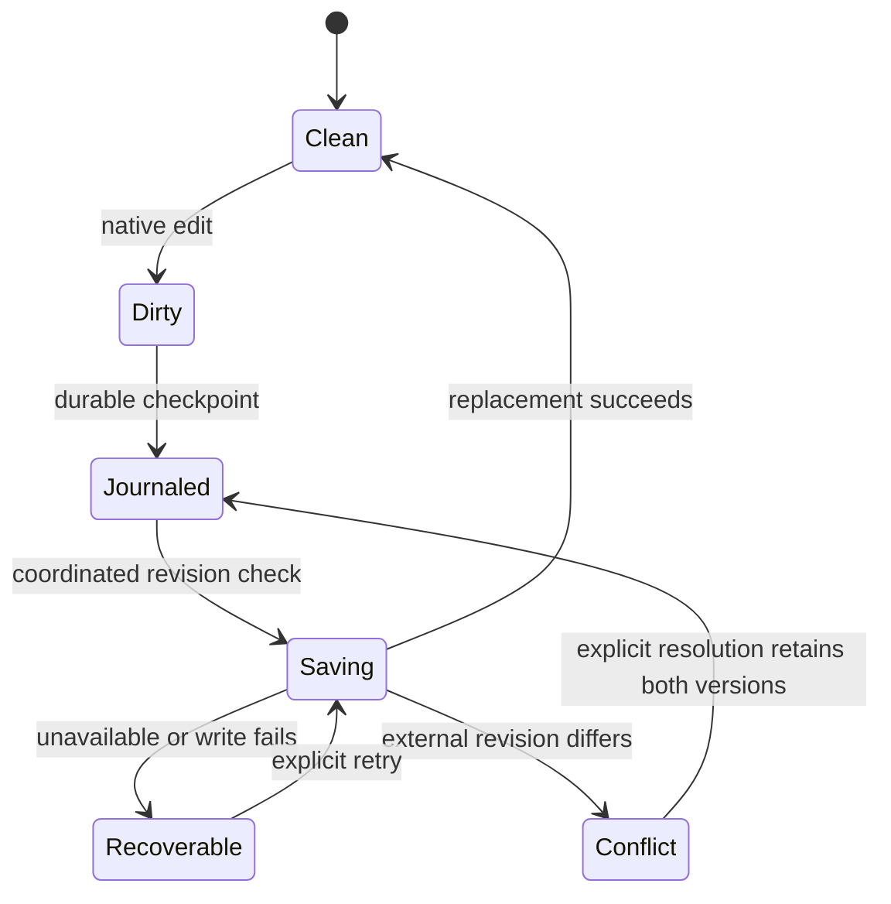
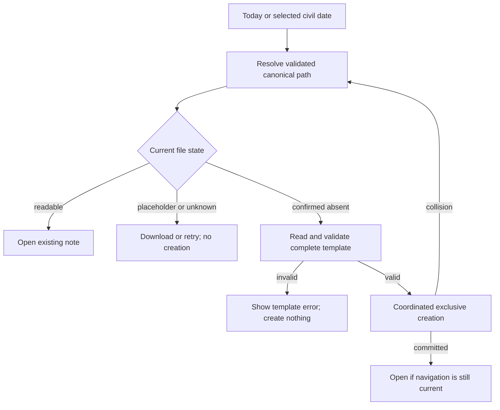

# obsidian-expo - Specification and Plan

This document combines the product specification and implementation plan, copied from the original Vault Notes planning project. It is adapted to this repository's user-requested Expo SDK 58 starter. The product requirements remain unchanged.

For cloud execution, read the committed [project context](../PROJECT_CONTEXT.md), [cloud development guide](../CLOUD_DEVELOPMENT.md), and [reference inventory](../references/README.md). No original conversation, sibling project, personal vault, or local Compound Engineering installation is required. Paths under the implementation units describe future work where files do not yet exist.

## Current Repository Status

The SDK 58 starter, Bun lockfile, type checking, linting, iOS development build, web starter, and CI are present. See [starter verification](../../VERIFICATION.md) for the evidence and its limits. U1 is partially complete: native vault-module integration, reproducible fixtures, meaningful unit tests, and iPad qualification remain. U2-U8 have not been implemented. Starter checks do not qualify the editor, vault safety, iCloud support, or performance targets below.

## Goal Capsule

**Objective:** Open today's note and start writing immediately, with fast access to the rest of an existing Markdown vault.

**Means:** An Expo app with native iOS document access and editing, as specified in KTD1-KTD4.

**Authority:** The user's latest instructions govern scope. Product requirements govern behavior; technical decisions govern implementation within those requirements. The executor selects technologies using the [October 2026 options and evidence](../technology-options-2026-10.md), rechecking current compatibility before adoption. Units and examples cannot override the product contract.

**Execution:** Build in this repository, using synthetic and disposable vaults first. The implementing agent owns implementation, local verification, documentation, and feature commits. Distribution, store submission, and changes to the user's personal vault are outside this execution contract.

**Stop conditions:** Stop real-vault writes if permission, file identity, or revision cannot be established. Preserve recoverable work and report the condition. A failed iCloud or performance qualification blocks claiming that capability complete; it does not block unrelated local development.

## Product Contract

### Summary

Build an iPhone and iPad Markdown editor that opens an existing vault in place. Provide fast search, a file explorer, file bookmarks, and a calendar that opens or creates daily notes. Once vault access and saving are reliable, make Today the default destination and support a small Templater-compatible date/time syntax.

### Problem Frame

The user wants Obsidian's core writing and retrieval experience with a responsive native interface. Their vault can contain thousands of Markdown files, including files stored in iCloud. The important daily habit is reaching today's note and writing without arranging files first.

### Key Decisions

- **Existing Markdown remains authoritative.** Compatibility begins with the files the user already owns. Governs R1-R4. (session-settled: user-directed - chosen over an app-only note database: existing Obsidian vaults must remain usable.)
- **Groundwork precedes convenience features.** Explorer, bookmarks, and calendar follow reliable editing and search. Governs R5-R12. (session-settled: user-directed - chosen over building the calendar first: the user requested these additions after the foundation.)

### Requirements

#### Vault and writing

- R1. Select and reopen a local or iCloud vault folder in place, with explicit recovery when permission or availability changes.
- R2. Read and edit UTF-8 Markdown without altering untouched content, frontmatter, wikilinks, embeds, or unsupported syntax; unsupported encodings remain readable where possible but cannot be overwritten through a lossy conversion.
- R3. Preserve edits through navigation, backgrounding, save errors, and process restart after a durable draft checkpoint; never silently overwrite a conflicting external revision.
- R4. Treat cloud placeholders and uncertain availability as existing or unknown files, never as permission to create replacements.
- R5. Offer native text selection, composition, undo/redo, dictation, hardware-keyboard input, and simple note creation with a user-chosen title and folder.

#### Finding and navigating

- R6. Search filenames and available note contents across a 10,000-note fixture, keeping typing and scrolling responsive while indexing.
- R7. Clearly distinguish complete results from indexing, unavailable cloud contents, or stale cached results; opening a result always resolves the current file.
- R8. Provide a left sidebar file explorer and file bookmarks, using a drawer at compact widths and a persistent sidebar when space permits.
- R9. Bookmark and unbookmark files per vault; missing bookmarks remain visible and removing a bookmark never deletes its note.

#### Daily writing

- R10. Show a month calendar whose selected day opens its existing daily note or creates the missing note once from the configured template.
- R11. After vault setup, open Today by default unless recoverable unsaved work needs attention first; a date rollover updates Today without replacing the active note.
- R12. Configure the daily-note folder, filename format, and template path per vault, with a preview before settings take effect.
- R13. Support the exact Templater subset in KTD6; validate the whole template before creating files or folders and show a useful error for unsupported syntax.
- R14. Use the selected calendar day for the target path and title, while `tp.date.now()` uses actual creation time; existing notes never receive the template again.
- R15. Deduplicate repeated open/create requests and prevent late completions from taking focus after the user navigates elsewhere.

#### Compatibility and quality

- R16. Keep app settings, bookmarks, recovery drafts, and search indexes outside the vault; do not modify `.obsidian` or execute community plugins.
- R17. Support VoiceOver, Dynamic Type, light/dark appearance, rotation, and iPad multitasking without obscuring the editor or save state.
- R18. Meet the measurable performance and data-integrity gates in the Verification Contract before describing the app as fast or iCloud-ready.

### Core Flows

- F1. Select vault -> configure daily-note location/template -> preview -> open Today. Cancelling selection preserves the previous vault. Covers R1, R10-R14.
- F2. Launch -> restore access -> resolve recovery if present -> open Today -> type -> see local save completion. Covers R1-R5, R11.
- F3. Search or browse -> open note -> edit -> bookmark -> return through the bookmark. Covers R5-R9.
- F4. Tap a calendar day -> resolve its canonical path -> open existing content or validate and create -> show the note (amended October 9, 2026, at the user's request: a note opens at its top without the keyboard, and a tap places the caret). Covers R4, R10, R13-R15.

### Acceptance Examples

| Example | Expected result | Covers |
| --- | --- | --- |
| Today's note already exists and the template is now invalid | Existing note opens unchanged | R10, R13, R14 |
| Yesterday is selected and its note is absent | Filename/title use yesterday; `tp.date.now()` uses the captured current clock | R14 |
| Today's file exists only as a cloud placeholder while offline | Show unavailable/retry; create nothing | R4 |
| Two rapid taps target the same date | One local file and one active editor session | R10, R15 |
| Another app edits a dirty note | Retain both versions and require explicit resolution | R3 |
| A bookmark's file disappears | Keep a missing entry with locate/remove actions | R9 |
| Midnight passes while writing yesterday's note | Today updates; the editor and selection stay put | R11 |

### Scope Boundaries

The first release edits Markdown source with restrained syntax styling. Full Obsidian Live Preview, rendered embeds, graph view, backlinks, plugin execution, arbitrary Templater JavaScript, bookmark synchronization with Obsidian, and a custom sync service are deferred. Mac, Android, and web are later platform work. No speed claim relative to Obsidian is justified until measured. Amended October 8, 2026, at the user's request: the editor shows line-level live preview (markers hidden except on the lines the caret touches) through the editor package recorded in T05 of the [technology decisions](../technology-decisions.md). Rendered embeds and the rest of the list above stay deferred.

### Repository References

The user approved sanitized examples for this public repository. The [reference inventory](../references/README.md) includes a representative daily note, its linked notes, a sanitized template, a supported basic template, and a vault-relative configuration. Use disposable copies for R2 preservation and R13 unsupported-template checks. No private originals or external local folders are required. Support for execution tags, variable expressions, or date formats outside KTD6 is not implied by compatibility testing.

The [technology options](../technology-options-2026-10.md) and [version snapshot](../references/technology-versions-2026-10-08.json) carry the newer research into this repository. They guide library selection within the user-requested SDK 58 and iOS scope; they do not authorize a downgrade or overwrite of the starter.

## Planning Contract

### Assumptions

- A1. Start feature implementation with iPhone/iPad under the user-selected project name `obsidian-expo`. The working product name Vault Notes is provisional; Android and web feature work and acceptance requirements are out of scope for now. The starter's cross-platform bundle checks do not expand this iOS-only scope.
- A2. Put Files and Bookmarks in the left sidebar. Show Calendar in a trailing panel on wide screens and a sheet on phones; only one navigation overlay is visible at a time.
- A3. Default daily notes to `Daily/YYYY-MM-DD.md`, with the built-in template described in KTD6. Show these settings on first setup so existing vault conventions can be entered before creation.
- A4. Performance thresholds below are engineering targets to validate, not observed results or framework guarantees.
- A5. "Latest" means the newest maintained, compatible choice available when implementation begins. October 8 research is a dated baseline; later October releases require fresh verification. The executor owns routine library choices and records their evidence.

### Key Technical Decisions

- KTD1. Use the user-requested Expo SDK 58 starter, currently `expo@58.0.6`, `react-native@0.88.0-rc.3`, and `react@19.3.0`, with resolved versions in `bun.lock`. SDK 58 is in beta as of this plan's date; do not silently downgrade to SDK 57. Use Bun, Expo Router, a project development build, and SDK-compatible package installation. Resolve T01-T03 and T12-T13 from the technology options within this SDK 58 baseline; record compatible versions and validation before dependent work. The starter was built with Xcode 27.0 and run on an iOS 27.0 simulator; requalify the toolchain when versions change. (session-settled: user-directed - Expo SDK 58 and the repository name were explicitly requested.) [Template metadata](https://registry.npmjs.org/expo-template-default/58.0.15), [SDK 58 beta](https://expo.dev/changelog/sdk-58-beta), [development builds](https://docs.expo.dev/develop/development-builds/introduction/).
- KTD2. Implement a small local Expo Swift module for the original vault and active document sessions. It owns security-scoped folder bookmarks, coordinated I/O, availability, conditional saves, and external-change reconciliation. Compare per-note `UIDocument` with explicit coordinator/presenter ownership, or a composition, using T03-T04. Keep provider I/O off the main thread. The general Expo filesystem API is not itself a complete coordinated-vault contract. Supports R1-R4.
- KTD3. Choose the source editor through T05: a local TextKit 2 view and Live Markdown are the primary native candidates, with other approaches documented behind explicit fidelity/input gates. Native input behavior, lossless source handling, and revisioned durable checkpoints are required. React receives status and bounded snapshots rather than controlling the full string on each keystroke. Preserve source characters and original newline conventions. Supports R2, R3, R5, R17.
- KTD4. Use application-private SQLite FTS5 as a disposable content index and metadata store. Choose `expo-sqlite` or OP-SQLite through T06 and `FlatList` or FlashList through T07. Use asynchronous, parameterized queries, bounded indexing batches, and virtualized results/explorer rows. Filename discovery precedes downloading/indexing content; rebuilding an index never rewrites notes. Supports R6-R9 and R16.
- KTD5. Provide a compact drawer, persistent wide sidebar, and separate calendar panel/sheet. Compare adaptive Router navigation with native split-view candidates through T08; preview APIs require evidence against their documented limitations. Choose native controls or appropriate RN components, a calendar, UI state, and styling through T09/T11. Supports R8, R10, R17. A technology choice cannot remove required navigation or accessibility behavior.
- KTD6. Parse an explicit Templater-compatible grammar, with no evaluation. Accept only `tp.file.title` and `tp.date.now(format?, offset?, reference?, reference_format?)` inside ordinary `<% ... %>` interpolation tags. Formats are limited to `YYYY-MM-DD`, `YYYYMMDD`, `YYYY-MM`, `YYYY-MM-DD HH:mm`, `HH:mm`, and `HH:mm:ss`; offsets are signed integer calendar days. References may be a strictly parsed quoted date or `tp.file.title`, with explicit `YYYY-MM-DD` or `YYYYMMDD` reference format. Omitted format means `YYYY-MM-DD`; omitted offset means zero. Capture the device clock/timezone once per expansion and use calendar arithmetic across DST. Reject execution/dynamic tags, unsupported arguments, and unknown commands. The built-in template is a heading using `tp.file.title`, a creation timestamp using `tp.date.now("YYYY-MM-DD HH:mm")`, and space to write. Supports R13-R14. [Templater date semantics](https://silentvoid13.github.io/Templater/internal-functions/internal-modules/date-module.html), [file title](https://silentvoid13.github.io/Templater/internal-functions/internal-modules/file-module.html). Amended October 8, 2026, at the user's request, so the user's daily template works: `<%* ... %>` scripts that only define dates with `moment(tp.file.title, pattern)`, `moment(date)`, or `moment()`, day or week offsets, and `.format(pattern)` are read, never run; `<% name %>` prints such a formatted date; `<%-` and `-%>` remove one line break; and formats are Moment patterns limited to `YYYY`, `MM`, `DD`, `HH`, `mm`, `ss`, and `WW` with separators, `T`, and bracketed text. Everything else stays rejected before any mutation. See [compatibility](../compatibility.md).
- KTD7. Store app-owned settings and bookmarks per stable vault identity. Allow `YYYY-MM-DD` and `YYYYMMDD` as filename formats and a validated relative folder/template path. Preserve a bookmark's identity across positively observed moves; otherwise offer locate/remove rather than guessing. Defer automatic `.obsidian` settings import because its private JSON is not a versioned integration contract. Supports R9, R12, R16. Amended October 9, 2026, at the user's request: first setup suggests the folder, file name format, and template from the vault's file names, without reading `.obsidian`, and the folder and template fields suggest the vault's folders and Markdown files while they are typed. The user still accepts the settings after the preview (R12). See [compatibility](../compatibility.md#daily-notes-and-templates). [Obsidian Daily notes](https://obsidian.md/help/plugins/daily-notes), [Bookmarks](https://obsidian.md/help/plugins/bookmarks).
- KTD8. The executor records selections in `docs/technology-decisions.md` before dependent work, comparing current documented alternatives and validating compatibility. Use T10 to select the date implementation without expanding KTD6. Apply the same policy to additional dependencies. Performance and correctness evidence take precedence over implementation effort or version numbers; no speed or compatibility claim is established by this plan alone.

### High-Level Technical Design

These sketches define responsibilities and ordering. File organization and private method signatures may change without changing the product contract. Concrete libraries follow KTD8; the persistence, source-fidelity, and lifecycle protocols remain mandatory with every candidate.

#### Boundaries

Native operations take opaque vault/document identities and relative paths, never arbitrary absolute paths from JavaScript. Validate containment, including symlinks and resolved parents, inside coordinated operations. Template files and Markdown are untrusted data. Do not log note bodies, template bodies, or bookmark grants. Indexes and drafts use application data protection and stay out of diagnostics.

Each async operation carries vault identity, document identity, revision, and a navigation generation. Saves serialize per document; stale search/open callbacks cannot replace current UI. Keep resource access alive until outstanding work settles. Cancelling a new vault picker leaves the old session intact.

#### Search data flow

#### Document lifecycle

| Transition | Native responsibility | UI consequence |
| --- | --- | --- |
| Open | Restore grant, establish identity and base revision | Editable only after readable contents arrive |
| Background | Checkpoint edits, finish allowed work, suspend presenters correctly | Keep recoverable unsaved status |
| Foreground | Restore observation and reconcile disk state | Reload clean content or expose conflict |
| Switch vault | Preserve draft and settle scoped operations before releasing resources | Ignore stale callbacks |

#### Template input shape

| Input | Accepted form | Result |
| --- | --- | --- |
| Plain Markdown | Text outside command tags | Preserve verbatim |
| Title | Ordinary interpolation of `tp.file.title` | Destination basename |
| Date/time | Ordinary interpolation of the allowlisted call in KTD6 | Formatted captured/reference date |
| Anything else inside tags | Unsupported command, argument, or format | Error before mutation |

#### Persistence Protocol

The draft journal records text, its base file fingerprint, and document identity atomically. A checkpoint failure keeps the editor open with an error; navigation must not claim unsaved text is safe. Autosave compares the current on-disk revision within coordinated access before replacement. A completed vault save means local persistence, not confirmed upload to every iCloud device.

Recovery appears before Today. An unchanged base permits restore; a changed base shows the draft and current disk version with a keep-both action. A deleted target offers Save As, never silent recreation. Keep every unresolved draft until a verified save or explicit discard. On clean external changes, reload while retaining a valid selection; on dirty changes, enter conflict handling. Reconcile on foreground because notifications alone are insufficient.

#### Daily-note Protocol

Deduplicate by vault and final path. Cancellation before creation begins creates nothing; cancellation after commit retains the valid note and does not steal focus. A retry first resolves the canonical path. A same-device create race must not clobber an existing file. Cross-device offline creation can still conflict through iCloud; retain provider conflict versions and expose resolution rather than claiming a distributed lock. [Apple conflict versions](https://developer.apple.com/documentation/foundation/nsfileversion).

### Sequence and Qualification

U1-U4 establish the local editing/search foundation. U5-U7 add the requested navigation and daily-writing experience. U8 qualifies the integrated result. Native file and editor experiments must use disposable fixtures; a visually complete calendar is not evidence of safe vault access.

The repository contains the verified SDK 58 starter. Reuse its app configuration, routes, Bun setup, and checks; do not scaffold over it. Feature paths below are proposed, and there is no existing vault implementation to preserve or migrate. Prefer focused modules for these current responsibilities; do not add plugin, storage-adapter, or cross-platform abstraction frameworks. Settle technology choices at the unit boundaries in the [decision handoff](../technology-options-2026-10.md#decision-handoff-by-implementation-unit), recording choices before dependent implementation.

## Implementation Units

### U1. Establish the Expo app and test fixtures

- Goal: Produce a bootable development build and reproducible vault fixtures.
- Requirements: R17-R18. Dependencies: none. Decisions: KTD1, KTD5, KTD8.
- Files: `package.json`, `bun.lock`, `app.json`, `src/app/_layout.tsx`, `src/app/index.tsx`, `scripts/generate-vault.ts`, `tests/fixtures/`, `docs/technology-decisions.md`, `README.md`.
- Approach: Extend the existing SDK 58 starter, remove demo content when the app shell replaces it, establish local native-module integration, and retain recorded toolchain versions. Resolve the testing/build choices using dated evidence and record a provisional editor compatibility check. Reuse type checking and lint scripts; add meaningful unit tests, fixture generation, and reproducible simulator validation. Keep generated native outputs under Expo's documented workflow.
- Test scenarios: Clean install and iPhone/iPad simulator launch; reproducible 10,000-note fixture, Unicode/frontmatter/wikilink fixtures, and long-note cases.
- Verification: Bun install, type check, lint, development build, simulator smoke check. Save fixture manifest and build commands in README.

### U2. Implement safe vault and document access

- Goal: Open and safely save fixture-vault files through the native boundary.
- Requirements: R1-R4, R16. Dependency: U1. Decisions: KTD2.
- Files: `modules/vault/ios/`, `modules/vault/src/`, `src/features/vault/`, `modules/vault/ios/Tests/`, `tests/integration/vault-session.test.ts`.
- Approach: Validate and record the T04 document-ownership choice. Implement folder selection/restoration, incremental enumeration, document identity, availability, coordinated read/conditional save/create, journal storage, and foreground reconciliation. Use the Persistence Protocol and native path containment checks.
- Test scenarios: Denied/stale grant, placeholder vs absence, concurrent create, external edit/rename/delete, failed journal/write, symlink escape, and vault switch during a save.
- Verification: Swift tests plus integration fixtures establish that no operation overwrites an unrecognized revision or turns an unreadable file into a new note.

### U3. Build the native writing loop

- Goal: Type, navigate, and recover without fighting the editor or losing acknowledged saves.
- Requirements: R2-R5, R17. Dependency: U2. Decisions: KTD3.
- Files: `modules/vault/ios/Editor/`, `src/features/editor/`, `src/features/recovery/`, `tests/e2e/editor/`, `modules/vault/ios/Tests/EditorTests.swift`.
- Approach: Validate T05 candidates against source fidelity, native input, long-note behavior, and the selected SDK; record the editor choice. Connect revisioned editing to the journal/save lifecycle. Add clear Saving, Saved locally, and Unsaved states, simple note creation, and explicit recovery actions. Introduce basic source styling only after selection/composition/undo work reliably.
- Test scenarios: Unicode/IME, dictation, undo/redo, hardware keyboard, large paste, background/termination after checkpoints, conflicting recovery, and read-only unsupported encodings. Round-trip a synthetic daily-note fixture, preserving its frontmatter and plugin syntax.
- Verification: Simulator end-to-end writing and recovery checks; native input checks on hardware where simulator input differs. Round-trip fixtures remain unchanged except intended edits.

### U4. Add incremental indexing and fast search

- Goal: Find and open notes without scanning the vault on every query.
- Requirements: R6-R7, R18. Dependencies: U2-U3. Decisions: KTD4.
- Files: `src/features/search/`, `src/storage/`, `tests/integration/search.test.ts`, `scripts/benchmark-search.ts`.
- Approach: Resolve T06 and the search portion of T07, including FTS/query semantics and write scheduling. Index available content in bounded batches, rank filename matches first, expose coverage, reconcile changes, and reject stale result generations. Prioritize active-document work over indexing.
- Test scenarios: 10,000 files, partial cloud availability, update/delete/rename, cancelled query, vault switch, index rebuild, and typing during index activity.
- Verification: Deterministic search correctness plus preliminary release-build measurements against the Verification Contract.

### U5. Add the explorer and file bookmarks

- Goal: Browse the vault and return to chosen notes quickly.
- Requirements: R8-R9, R16-R17. Dependencies: U3-U4. Decisions: KTD4-KTD5, KTD7.
- Files: `src/features/explorer/`, `src/features/bookmarks/`, `src/components/VaultSidebar.tsx`, `tests/e2e/navigation/`.
- Approach: Validate T07-T08/T11 for explorer virtualization, navigation, state subscriptions, and styling. Flatten expanded folders into virtualized rows, expose bookmark actions, and adapt the sidebar to available width. Persist per-vault metadata and support explicit missing-bookmark recovery.
- Test scenarios: Deep folders, duplicate basenames across vaults, observed rename, unresolved deletion, restart persistence, narrow iPad multitasking, and VoiceOver focus.
- Verification: Bookmark round trip and responsive navigation on iPhone/iPad with the large fixture; no `.obsidian` modifications.

### U6. Implement templates and daily-note resolution

- Goal: Deterministically open or create one daily note using the declared syntax.
- Requirements: R10, R12-R16. Dependencies: U2-U3. Decisions: KTD6-KTD7.
- Files: `src/features/daily-notes/`, `src/features/templates/`, `tests/unit/templates.test.ts`, `tests/unit/daily-path.test.ts`, `tests/integration/daily-create.test.ts`.
- Approach: Resolve the T10 date implementation and explicit format adapter without changing KTD6. Build the pure parser/renderer with injected clock and calendar context, settings preview, and the Daily-note Protocol. Validate complete output before requesting any native mutation.
- Test scenarios: Existing note with broken template, invalid tags/arguments, selected historical date, explicit title reference, DST/leap-day/year rollover, invalid path, repeated taps, and a create collision. Synthetic templates containing unsupported execution tags, variable expressions, and date formats must produce an unsupported-command error with no mutations; the supported starter template must create successfully.
- Verification: Deterministic unit tests and native create integration confirm expected text, canonical filenames, and zero mutations after template errors.

### U7. Connect calendar, Today, and the writing destination

- Goal: Launch into today's note and begin writing, with other dates one tap away.
- Requirements: R10-R12, R14-R15, R17. Dependencies: U5-U6. Decisions: KTD5.
- Files: `src/features/calendar/`, `src/app/index.tsx`, `src/features/settings/`, `tests/e2e/daily-notes/`.
- Approach: Resolve T09 using day-selection and accessibility checks, including a repeated tap on the selected date. Connect month navigation and Today to the resolver. Respect recovery priority, avoid creating notes while merely paging months, and restore editor focus after deliberate note selection.
- Test scenarios: First setup, relaunch, existing/absent/offline Today, rapid multi-day selection, cancellation, midnight/timezone change, keyboard visible, and accessibility navigation.
- Verification: End-to-end open Today -> write -> relaunch -> unchanged text, on both phone and tablet layouts.

### U8. Qualify integrity, iCloud, and performance

- Goal: Establish what the integrated app actually supports on named devices.
- Requirements: R1-R18. Dependencies: U1-U7.
- Files: `tests/e2e/`, `scripts/benchmarks/`, `docs/validation.md`, `docs/compatibility.md`, `README.md`.
- Approach: Run disposable local/iCloud vault scenarios and release benchmarks. Document the exact template subset, source-editor behavior, and measured platform limits. Resolve failures before claiming the affected capability complete.
- Test scenarios: Two-device offline same-day creation, provider conflict, cloud eviction/download, external Obsidian edit, interrupted save, large vault indexing, long-note input, and recovery before Today.
- Verification: Evidence table links commands, hardware/OS/build, fixture, samples, outcomes, and unresolved limitations. Remove abandoned experiments and unused demo code.

## Verification Contract

`bun run typecheck` and `bun run lint` are established and passing for the starter. U1 must add meaningful tests, fixture generation, and native-module validation; a test runner with no tests does not qualify. Choose runners per T12: Bun may run pure logic, while Expo components need a validated native-component testing setup. Establish `bun run test` when those tests exist. Record Swift Testing/XCTest and simulator end-to-end commands after inspecting the generated Xcode scheme. Run Expo dependency checks for the selected version group. Do not invent a passing test or conceal unavailable device coverage.

Integrity gates are absolute: intended text round-trips, unchanged files remain byte-identical, invalid templates create nothing, local create races never overwrite, conflicts retain both versions, and every Saved locally indication follows a successful coordinated save. Termination before a durable checkpoint can lose the most recent uncheckpointed input; characterize that window rather than promising crash-proof keystrokes.

Performance uses a release build on a named physical iPhone, with 10,000 UTF-8 notes of 2-8 KiB, a documented total byte count, and separate 100 KiB/1 MiB editing stress cases. Capture 30 launch/open samples and at least 100 representative search queries. Report cold and warm conditions separately, excluding network download time from local targets but reporting that time separately.

| Measure | Initial acceptance target | Measurement |
| --- | --- | --- |
| Returning cold launch to editable, already-local Today | p95 <= 1.5 seconds | Process launch to native editor ready |
| Warm switch to an already-local note | p95 <= 200 ms | User selection to editor ready |
| Warm indexed search | p95 <= 100 ms | Query change to first rendered results, including debounce |
| Native typing during indexing | No main-thread stall over 100 ms in a 60-second typing trace | Instruments trace with input and frame timestamps |
| Local save after typing stops | p95 <= 500 ms | Last edit to successful save acknowledgement |

Use realistic long notes to characterize scaling; a hard size cutoff is not an acceptable silent substitute for responsive editing. If targets fail, measure the owning stage and improve it before weakening the requirement. Simulator success can verify flows but cannot qualify hardware performance or multi-device iCloud behavior.

Accessibility verification covers VoiceOver traversal, labeled calendar days/selection, maximum Dynamic Type, keyboard dismissal, focus after drawers/sheets, and narrow iPad windows. Screenshots should show clear save/error states without clipping or placeholder UI.

## Definition of Done

- `docs/technology-decisions.md` records current-source checks, chosen versions, alternatives, compatibility evidence, and unit-specific validation. The final dependency graph is reproducible from `bun.lock` and the documented native toolchain.
- Every unit's scenarios pass with evidence in `docs/validation.md`; unavailable checks remain explicit and the affected capability remains unqualified.
- The user can select a disposable vault, open Today, write, search, browse, bookmark, choose another calendar day, and reopen saved content.
- Integrity gates and the stated hardware performance targets pass before a completed-app claim.
- iCloud support is demonstrated with disposable vaults on real devices, including conflicting external changes.
- Compatibility documentation states the exact supported template syntax and deferred Obsidian features.
- Changes are committed by completed unit with conventional lowercase messages. The approved sanitized examples and small authored synthetic fixtures may be committed along with their generation scripts. Do not publish the private originals, real journal contents, credentials, generated large-vault data, or discarded experiments.
